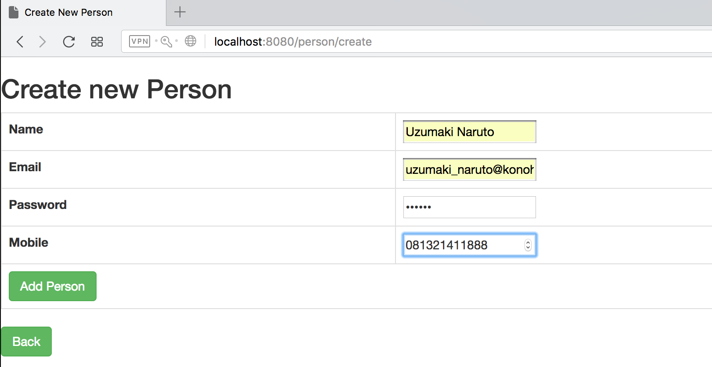
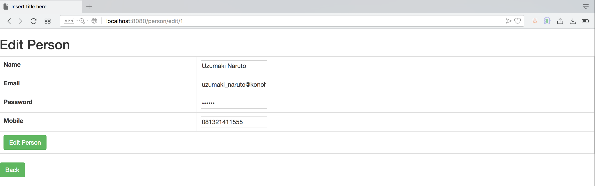

# SpringBoot-MVC-application
SpringBoot Gradle MVC  sample application

This is a sample Spring Boot Application that uses 
  1. JDBC
  2. Mysql
  3. JPA
  4. MVC
  5. Gradle
  
To use this application follow the steps listed below
  1. git clone https://github.com/hendisantika/spring-boot-maven-mvc.git
  2. go to this directory
  3. add mysql database name and password in application.properties
  4. go to mysql and create a database with name mentioned in application.properties
  5. run commands
    a. gradle clean;
    b. gradle build;
    c. gradle bootRun;

Home Page

Add New Data

Edit Data

And you are good to go. 

#Happy coding !!
